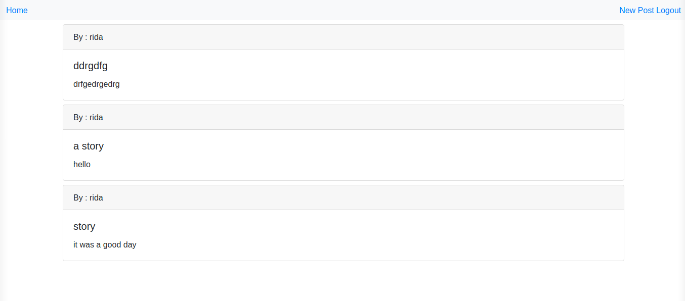

# ReFormer

This project is about an exclusive clubhouse where your members can write embarrassing posts about non-members. Inside the clubhouse, members can see who the author of a post is but, outside, they can only see the story and wonder who wrote it.


## ScreenShoot



## Built With

- Ruby 2.7.1
- Rails 6.0.3.2
- VS Code


## Prerequisites
In order to make the program work, you need to have ruby interpreter installed in your system. You can get the latest version of ruby from [official website](https://www.ruby-lang.org/en/downloads/).


## Getting Started 

1. clone the project

```bash
# Clone this repository
$ git clone https://github.com/8Bts/Members-Only.git

# Go into the repository
$ cd Members-Only

# make sure you have ruby 2.7.1
# install gems from Gemfile using bundle
$ bundle install

# migrate table to database

$ rails db:migrate

# run the server

$ rails server
```

## Usage

- open this link 127.0.0.1:3000/users/sign_up

- create a new user

- click on New post link to create posts

## Authors

👤 **Rashid Mammadli**

- Github: [8Bts](https://github.com/8Bts)
- Twitter: [@Rasheed49705929](https://twitter.com/Rasheed49705929)
- Linkedin: [linkedin](https://www.linkedin.com/in/mcmizze-price-238a70135/)
- Email: mcmizze@yahoo.com

👤 **Rida Elbahtouri**
- [Github](https://github.com/rida-elbahtouri)
- [Twitter](https://twitter.com/RElbahtouri)
- [Linkedin](https://www.linkedin.com/in/rida-elbahtouri-36a8a7185/)

## 🤝 Contributing

Contributions, issues and feature requests are welcome!

Feel free to check the <a href="https://github.com/8Bts/Members-Only/issues" target="_blank">issues page</a>.

## Show your support

Give a ⭐️ if you like this project!

## Acknowledgments
 
- <a href="https://www.theodinproject.com/" target="_blank">The Odin Project</a>
- <a href="https://guides.rubyonrails.org/" target="_blank">Rails Guides</a>


